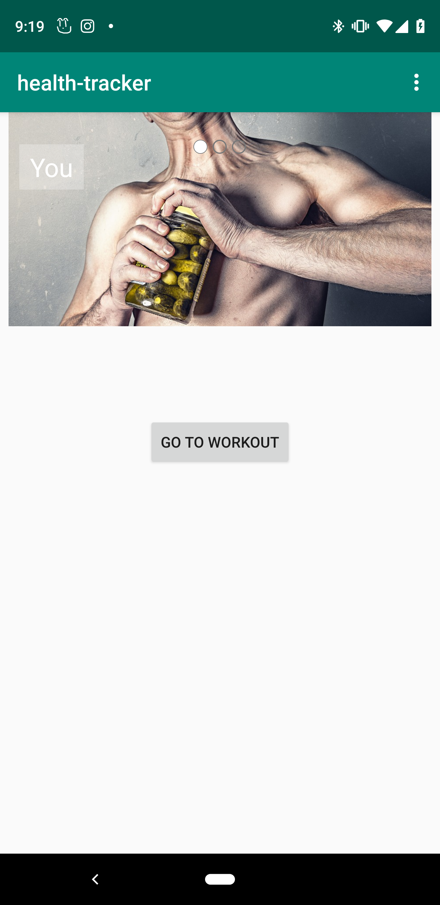

# Codefellowship
Building an Android health tracker app. The features are built out over the next several labs.
## Feature Task

### lab 26 - Feature Tasks

#### Finger Exercises
One key part of health is building finger strength and endurance.

On the main page, display a number and a button. The number should increase when the button is clicked.

#### Stopwatch

On the main page, add a stopwatch.

Have a button to `[Start/Pause]` and `Reset` the clock. The start/pause button should toggle between saying "start" and "pause". And you should only be able to reset when the stopwatch is paused.

Have the view udpate as fast as possible while still leaving the buttons responsive

Display the clock as `0:00:00.000` so it should be able to track up to 9 hours, 59 minutes, 59 seconds, and 999 miliseconds.

#### Inspiring Image Carousel

Display an image carousel with caption. Allow users to cycle through images and read captions. Pressing next should go to the next image and its caption, pressing prev should go back

The app should display a `(1/N)`, `(2/N)` indicator so users know how many items are in the list.

#### Navigation

Clear up the homepage and allow users to visit individual pages for those various features.

Move Finger Exercises and Stopwatch into their own pages. Add button on the homepage to link to those pages, and ensure that the user can use the back button on the device to return to the app homepage. 

#### Health Notifications

Create a new activity for Notifications

Allow users to set up reminders to drink water, which should appear every 2 hours in the notification (For testing, length is shorten to 5, 10, or 30 seconds in the menu) 

## Changelog

01/08/2019

* Began lab 26
* Complete button counter feature
* Complete Timer feature
    
01/09/2019

* Continue working lab 26
* Complete carousel feature
* Added in reset button for counter
* Began unit testing
* added in readme

01/10/2019
* changed carousel 
* created new activity
* started notification

01/11/2019
* Finished notification
* cleaned up styling
* updated readme
