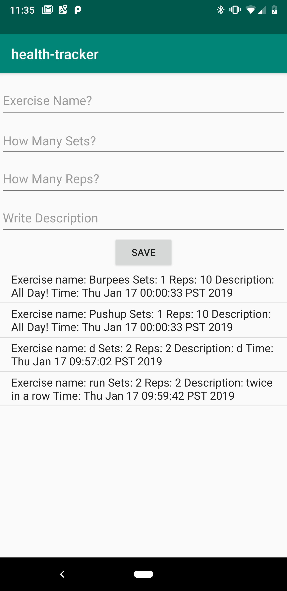

# Codefellowship
Building an Android health tracker app. The features are built out over the next several labs.
## Feature Task

### lab 26 - Feature Tasks

#### Finger Exercises
One key part of health is building finger strength and endurance.

On the main page, display a number and a button. The number should increase when the button is clicked.

#### Stopwatch

On the main page, add a stopwatch.

Have a button to `[Start/Pause]` and `Reset` the clock. The start/pause button should toggle between saying "start" and "pause". And you should only be able to reset when the stopwatch is paused.

Have the view udpate as fast as possible while still leaving the buttons responsive

Display the clock as `0:00:00.000` so it should be able to track up to 9 hours, 59 minutes, 59 seconds, and 999 miliseconds.

#### Inspiring Image Carousel

Display an image carousel with caption. Allow users to cycle through images and read captions. Pressing next should go to the next image and its caption, pressing prev should go back

The app should display a `(1/N)`, `(2/N)` indicator so users know how many items are in the list.

#### Navigation

Clear up the homepage and allow users to visit individual pages for those various features.

Move Finger Exercises and Stopwatch into their own pages. Add button on the homepage to link to those pages, and ensure that the user can use the back button on the device to return to the app homepage. 

#### Health Notifications

Create a new activity for Notifications

Allow users to set up reminders to drink water, which should appear every 2 hours in the notification (For testing, length is shorten to 5, 10, or 30 seconds in the menu) 

#### Exercise Activity Diary

##### Database Setup

Set up a database to contain `Exercise` data. Each `Exercise` should have a `title`, `sets`, `reps` ,and `description`, as well as a `timestamp`. For testing, add a single Exercise to the database.

##### Displaying the Exercise Diary

Add a new Activity to hold the Exercise Diary. In that view, display all entries from the Exercise database in a `ListView`. (At this point, that should show a single row.) Make sure that Exercise looks reasonable.

At the top of the Exercise activity log, add a form that allows a user to enter data about an exercise. When they hit submit, the information about that exercise should be stored in the database and displayed in the `ListView`. You can choose how the timestamp works: either let the user enter when they completed the exercise, or use the time when they hit submit on the form.

##### Camera Functionality

Add the ability for users to enter a profile picture. Give them the option of taking a new photo with the camera and/or using images already on their phone. 

Home Page Without User Profile Image           |  Camera Activity
:-------------------------:|:-------------------------:
  |  

User accessing external storage         |  Page With User Profile Image
:-------------------------:|:-------------------------:
  |  

## Changelog

01/08/2019

* Began lab 26
* Complete button counter feature
* Complete Timer feature
    
01/09/2019

* Continue working lab 26
* Complete carousel feature
* Added in reset button for counter
* Began unit testing
* added in readme

01/10/2019
* changed carousel 
* created new activity
* started notification

01/11/2019
* Finished notification
* cleaned up styling
* updated readme

01/11/2019
* added in database

01/13/2019
* added in list view

01/15/2019
* added list view which renders test data from database 

01/16/2019
* added in adapter activity to render data from room dynamically to custom view

01/17/2019
* Migrated to androidX and setup instrumentation testing environment

01/18/2019
* added in instrumentation test for Exercise Activity Log and updated readme.

01/22/2019
* Finished camera and upload functionality

01/23/2019
* Fixed tests and added in additional tests

01/24/2019
* Updated Readme and added in tests

#### Credits:
Notification credit: https://gist.github.com/BrandonSmith/6679223

Listview credit: https://abhiandroid.com/ui/listview

Passing string into an int dao parameter: Michelle Ferreirae and https://stackoverflow.com/questions/4903515/how-do-i-return-an-int-from-edittext-android

Setting up instrument testing: https://developer.android.com/training/testing/set-up-project and https://developer.android.com/training/data-storage/room/testing-db#java, Amy Cohen - For debugging my thread issues, Sooz Richman and Tara Johnson for help setting things up. 

Camera: https://demonuts.com/android-custom-camera/

Multiple Runtime Permission: https://demonuts.com/android-runtime-permissions/

Uploading Images: http://viralpatel.net/blogs/pick-image-from-galary-android-app/

Camera2: https://proandroiddev.com/understanding-camera2-api-from-callbacks-part-1-5d348de65950

